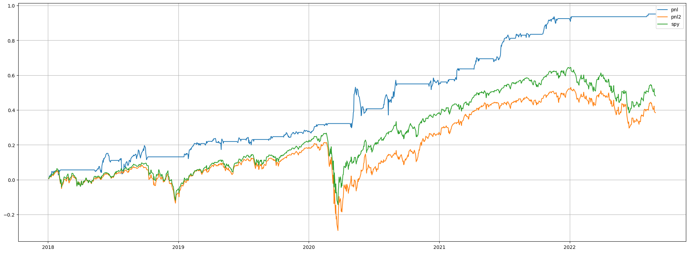

# Machine Learning Method Applied on Portfolio Optimization

A regime-based investing strategy is implemented in this repo, it contains

- A script which downloads all component stocks' prices in S&P 500 and calculate their technique indicators using `pandas` and `ta-lib`.
- Study of regime detection models:
  - Gaussian mixture model
  - Hidden markov model
  - K-means
- Using support vector machine to select stocks in re-adjusting portfolio windows
- Implementation of the global minimum variance portfolio, covariance matrix is estimated by constant correlation shrinkage method.
- Taking 3% transaction fee into account

## Back-testing results

pnl is the performance of this strategy, orange line is equal-weighted portfolio and green line is SPY.

